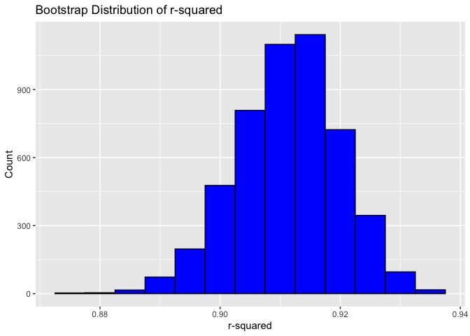
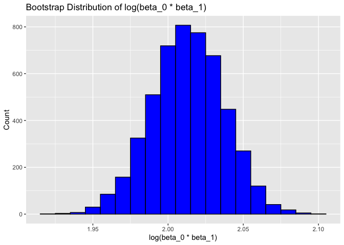
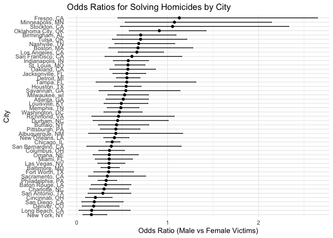
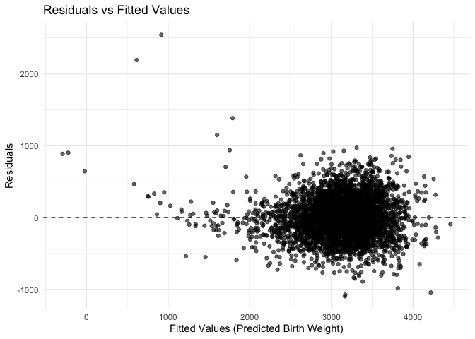

Homework 6
================
Mingyin Wang
2024-12-02

load packages

## Problem 1

load dataframe

``` r
weather_df = 
  rnoaa::meteo_pull_monitors(
    c("USW00094728"),
    var = c("PRCP", "TMIN", "TMAX"), 
    date_min = "2017-01-01",
    date_max = "2017-12-31") %>%
  mutate(
    name = recode(id, USW00094728 = "CentralPark_NY"),
    tmin = tmin / 10,
    tmax = tmax / 10) %>%
  select(name, id, everything())
```

    ## using cached file: /Users/wangmingyin/Library/Caches/org.R-project.R/R/rnoaa/noaa_ghcnd/USW00094728.dly

    ## date created (size, mb): 2024-09-26 10:05:50.690547 (8.651)

    ## file min/max dates: 1869-01-01 / 2024-09-30

Bootstrap Function

``` r
compute_bootstrap = function(data) {
  model = lm(tmax ~ tmin, data = data)
    r_squared = broom::glance(model)$r.squared
    coefs = broom::tidy(model)$estimate
  log_beta = log(coefs[1] * coefs[2])
  tibble(r_squared = r_squared, log_beta = log_beta)
}
```

Generate 5000 bootstrap samples

``` r
set.seed(1) 

bootstrap_results = weather_df |>
  modelr::bootstrap(n = 5000) |>
  mutate(
    estimates = map(strap, ~ compute_bootstrap(as.data.frame(.x)))  
  ) |>
  unnest(estimates)
```

Compute confidence interval

``` r
bootstrap_summary = bootstrap_results |>
  summarise(
    r_squared_lower = quantile(r_squared, 0.025),
    r_squared_upper = quantile(r_squared, 0.975),
    log_beta_lower = quantile(log_beta, 0.025),
    log_beta_upper = quantile(log_beta, 0.975)
  )
bootstrap_summary
```

    ## # A tibble: 1 × 4
    ##   r_squared_lower r_squared_upper log_beta_lower log_beta_upper
    ##             <dbl>           <dbl>          <dbl>          <dbl>
    ## 1           0.894           0.927           1.96           2.06

Plot the R-squared distribution

``` r
ggplot(bootstrap_results, aes(x = r_squared)) +
  geom_histogram(binwidth = 0.005, fill = "blue", color = "black") +
  labs(title = "Bootstrap Distribution of r-squared", x = "r-squared", y = "Count")
```

<!-- -->

Plot the log(B0\*B1)

``` r
ggplot(bootstrap_results, aes(x = log_beta)) +
  geom_histogram(binwidth = 0.01, fill = "blue", color = "black") +
  labs(title = "Bootstrap Distribution of log(beta_0 * beta_1)", x = "log(beta_0 * beta_1)", y = "Count")
```

<!-- -->

The distribution is approximately symmetric, with values ranging from
1.95 to 2.10 and a peak around 2.02, indicating stable and consistent
estimates across bootstrap samples. The narrow spread suggests
robustness in the linear model used to predict tmax from tmin. A 95%
confidence interval, derived from the 2.5% and 97.5% quantiles of the
distribution, would provide a reliable range of plausible values for
log(β0\* β1).

## Problem 2

load data

``` r
url = "https://raw.githubusercontent.com/washingtonpost/data-homicides/master/homicide-data.csv"
homicide_data = read_csv(url)
```

    ## Rows: 52179 Columns: 12
    ## ── Column specification ────────────────────────────────────────────────────────
    ## Delimiter: ","
    ## chr (9): uid, victim_last, victim_first, victim_race, victim_age, victim_sex...
    ## dbl (3): reported_date, lat, lon
    ## 
    ## ℹ Use `spec()` to retrieve the full column specification for this data.
    ## ℹ Specify the column types or set `show_col_types = FALSE` to quiet this message.

``` r
head(homicide_data)
```

    ## # A tibble: 6 × 12
    ##   uid   reported_date victim_last victim_first victim_race victim_age victim_sex
    ##   <chr>         <dbl> <chr>       <chr>        <chr>       <chr>      <chr>     
    ## 1 Alb-…      20100504 GARCIA      JUAN         Hispanic    78         Male      
    ## 2 Alb-…      20100216 MONTOYA     CAMERON      Hispanic    17         Male      
    ## 3 Alb-…      20100601 SATTERFIELD VIVIANA      White       15         Female    
    ## 4 Alb-…      20100101 MENDIOLA    CARLOS       Hispanic    32         Male      
    ## 5 Alb-…      20100102 MULA        VIVIAN       White       72         Female    
    ## 6 Alb-…      20100126 BOOK        GERALDINE    White       91         Female    
    ## # ℹ 5 more variables: city <chr>, state <chr>, lat <dbl>, lon <dbl>,
    ## #   disposition <chr>

Create `city_state` variable and clean the data

``` r
homicide_cleaned = homicide_data |>
  mutate(city_state = paste(city, state, sep = ", "),
         victim_age = as.numeric(victim_age)) |>
  filter(!city_state %in% c("Dallas, TX", "Phoenix, AZ", "Kansas City, MO", "Tulsa, AL"),
         victim_race %in% c("White", "Black"), 
         !is.na(victim_age),                  
         !is.na(disposition))        
```

    ## Warning: There was 1 warning in `mutate()`.
    ## ℹ In argument: `victim_age = as.numeric(victim_age)`.
    ## Caused by warning:
    ## ! NAs introduced by coercion

``` r
head(homicide_cleaned)
```

    ## # A tibble: 6 × 13
    ##   uid   reported_date victim_last victim_first victim_race victim_age victim_sex
    ##   <chr>         <dbl> <chr>       <chr>        <chr>            <dbl> <chr>     
    ## 1 Alb-…      20100601 SATTERFIELD VIVIANA      White               15 Female    
    ## 2 Alb-…      20100102 MULA        VIVIAN       White               72 Female    
    ## 3 Alb-…      20100126 BOOK        GERALDINE    White               91 Female    
    ## 4 Alb-…      20100130 MARTIN-LEY… GUSTAVO      White               56 Male      
    ## 5 Alb-…      20100308 GRAY        STEFANIA     White               43 Female    
    ## 6 Alb-…      20100323 DAVID       LARRY        White               52 Male      
    ## # ℹ 6 more variables: city <chr>, state <chr>, lat <dbl>, lon <dbl>,
    ## #   disposition <chr>, city_state <chr>

Create a Binary Outcome Variable for Solved Cases

``` r
 homicide_cleaned =  homicide_cleaned |>
  mutate(solved = if_else(str_detect(disposition, "Closed"), 1, 0))
```

Logistic Regression for Baltimore, MD

``` r
baltimore_data = homicide_cleaned |>
  filter(city_state == "Baltimore, MD")

baltimore_model = glm(solved ~ victim_age + victim_sex + victim_race,
                       data = baltimore_data,
                       family = binomial)


baltimore_results = tidy(baltimore_model, conf.int = TRUE, exponentiate = TRUE)

baltimore_results
```

    ## # A tibble: 4 × 7
    ##   term             estimate std.error statistic  p.value conf.low conf.high
    ##   <chr>               <dbl>     <dbl>     <dbl>    <dbl>    <dbl>     <dbl>
    ## 1 (Intercept)         1.94    0.174        3.80 1.42e- 4    1.38      2.74 
    ## 2 victim_age          0.995   0.00325     -1.60 1.10e- 1    0.988     1.00 
    ## 3 victim_sexMale      0.355   0.143       -7.26 3.74e-13    0.267     0.468
    ## 4 victim_raceWhite    2.46    0.180        4.99 6.04e- 7    1.73      3.52

Logistic Regression for All Cities

``` r
nested_data = homicide_cleaned |>
  group_by(city_state) |>
  nest()

fit_model = function(df) {
  glm(solved ~ victim_age + victim_sex + victim_race, data = df, family = binomial) %>%
    tidy(conf.int = TRUE, exponentiate = TRUE) |>
    filter(term == "victim_sexMale")
}

results = nested_data |>
  mutate(model_results = map(data, fit_model)) |>
  unnest(model_results)
```

    ## Warning: There were 44 warnings in `mutate()`.
    ## The first warning was:
    ## ℹ In argument: `model_results = map(data, fit_model)`.
    ## ℹ In group 1: `city_state = "Albuquerque, NM"`.
    ## Caused by warning:
    ## ! glm.fit: fitted probabilities numerically 0 or 1 occurred
    ## ℹ Run `dplyr::last_dplyr_warnings()` to see the 43 remaining warnings.

create the plot

``` r
results |>
  ggplot(aes(x = reorder(city_state, estimate), y = estimate)) +
  geom_point() +
  geom_errorbar(aes(ymin = conf.low, ymax = conf.high), width = 0.2) +
  coord_flip() +
  labs(
    title = "Odds Ratios for Solving Homicides by City",
    x = "City",
    y = "Odds Ratio (Male vs Female Victims)"
  ) +
  theme_minimal()
```

<!-- -->

An odds ratio of 1 indicates no difference between genders, while values
greater than 1 suggest a higher likelihood of solving homicides for male
victims, and values less than 1 indicate a higher likelihood for female
victims. The horizontal lines represent 95% confidence intervals, where
narrower intervals indicate greater precision, and wider intervals
suggest more uncertainty. Most cities cluster around an odds ratio of 1,
indicating little to no gender-based difference in solving homicides,
though some cities show significant deviations with varying confidence
intervals, possibly due to small sample sizes or other factors.

## Problem 3

load data

``` r
birthweight_data = read_csv("data/birthweight.csv")
```

    ## Rows: 4342 Columns: 20
    ## ── Column specification ────────────────────────────────────────────────────────
    ## Delimiter: ","
    ## dbl (20): babysex, bhead, blength, bwt, delwt, fincome, frace, gaweeks, malf...
    ## 
    ## ℹ Use `spec()` to retrieve the full column specification for this data.
    ## ℹ Specify the column types or set `show_col_types = FALSE` to quiet this message.

``` r
head(birthweight_data)
```

    ## # A tibble: 6 × 20
    ##   babysex bhead blength   bwt delwt fincome frace gaweeks malform menarche
    ##     <dbl> <dbl>   <dbl> <dbl> <dbl>   <dbl> <dbl>   <dbl>   <dbl>    <dbl>
    ## 1       2    34      51  3629   177      35     1    39.9       0       13
    ## 2       1    34      48  3062   156      65     2    25.9       0       14
    ## 3       2    36      50  3345   148      85     1    39.9       0       12
    ## 4       1    34      52  3062   157      55     1    40         0       14
    ## 5       2    34      52  3374   156       5     1    41.6       0       13
    ## 6       1    33      52  3374   129      55     1    40.7       0       12
    ## # ℹ 10 more variables: mheight <dbl>, momage <dbl>, mrace <dbl>, parity <dbl>,
    ## #   pnumlbw <dbl>, pnumsga <dbl>, ppbmi <dbl>, ppwt <dbl>, smoken <dbl>,
    ## #   wtgain <dbl>

``` r
birthweight_data_cleaned = birthweight_data |>
  mutate(
    babysex = factor(babysex, levels = c(1, 2), labels = c("Male", "Female")),
    malform = factor(malform, levels = c(0, 1), labels = c("Absent", "Present")),
    mrace = factor(mrace),
    frace = factor(frace)
  ) |>
  drop_na() 
```

linear model

``` r
proposed_model = lm(bwt ~ babysex + bhead + blength + delwt + gaweeks + wtgain, 
                     data = birthweight_data_cleaned)
summary(proposed_model)
```

    ## 
    ## Call:
    ## lm(formula = bwt ~ babysex + bhead + blength + delwt + gaweeks + 
    ##     wtgain, data = birthweight_data_cleaned)
    ## 
    ## Residuals:
    ##      Min       1Q   Median       3Q      Max 
    ## -1094.98  -183.45    -9.24   172.86  2541.84 
    ## 
    ## Coefficients:
    ##                 Estimate Std. Error t value Pr(>|t|)    
    ## (Intercept)   -6239.0299    97.7578 -63.821  < 2e-16 ***
    ## babysexFemale    32.5114     8.7146   3.731 0.000193 ***
    ## bhead           137.1713     3.5293  38.867  < 2e-16 ***
    ## blength          78.8211     2.0673  38.127  < 2e-16 ***
    ## delwt             1.5966     0.2161   7.388 1.78e-13 ***
    ## gaweeks          13.1690     1.4951   8.808  < 2e-16 ***
    ## wtgain            2.2042     0.4353   5.063 4.30e-07 ***
    ## ---
    ## Signif. codes:  0 '***' 0.001 '**' 0.01 '*' 0.05 '.' 0.1 ' ' 1
    ## 
    ## Residual standard error: 281.6 on 4335 degrees of freedom
    ## Multiple R-squared:  0.6981, Adjusted R-squared:  0.6977 
    ## F-statistic:  1671 on 6 and 4335 DF,  p-value: < 2.2e-16

The variables included in the model to predict birth weight are chosen
for their biological relevance. Baby’s sex, head circumference, and
length at birth are direct indicators of size and growth. Maternal
weight at delivery and weight gain during pregnancy reflect maternal
health and nutrition, which influence fetal growth. Gestational age
captures the duration of pregnancy, a key determinant of birth weight.

use add_predictions and add_residuals in making this plot

``` r
data_with_residuals = birthweight_data_cleaned |>
  add_predictions(proposed_model) |>
  add_residuals(proposed_model)

data_with_residuals |>
  ggplot(aes(x = pred, y = resid)) +
  geom_point(alpha = 0.6) +
  geom_hline(yintercept = 0, linetype = "dashed") +
  labs(
    title = "Residuals vs Fitted Values",
    x = "Fitted Values (Predicted Birth Weight)",
    y = "Residuals"
  ) +
  theme_minimal()
```

<!-- --> two
other models One using length at birth and gestational age as predictors
(main effects only) One using head circumference, length, sex, and all
interactions (including the three-way interaction) between these

``` r
proposed_formula = bwt ~ gaweeks + blength + bhead + wtgain
model1_formula = bwt ~ blength + gaweeks
model2_formula = bwt ~ bhead * blength * babysex
```

cross validation

``` r
set.seed(123)
cv_data = crossv_mc(birthweight_data_cleaned, 10) 
```

Define RMSE computation function

``` r
compute_rmse = function(train_data, test_data, formula) {
  model = lm(formula, data = train_data)
  predictions = predict(model, newdata = test_data)
  sqrt(mean((test_data$bwt - predictions)^2))
}
```

Compute RMSE for each model

``` r
cv_results = cv_data |>
  mutate(
    proposed_rmse = map2_dbl(train, test, ~ compute_rmse(as.data.frame(.x), as.data.frame(.y), proposed_formula)),
    model1_rmse = map2_dbl(train, test, ~ compute_rmse(as.data.frame(.x), as.data.frame(.y), model1_formula)),
    model2_rmse = map2_dbl(train, test, ~ compute_rmse(as.data.frame(.x), as.data.frame(.y), model2_formula))
  )
```

``` r
cv_results_summary = cv_results |>
  summarise(
    proposed_avg_rmse = mean(proposed_rmse),
    model1_avg_rmse = mean(model1_rmse),
    model2_avg_rmse = mean(model2_rmse)
  )
cv_results_summary
```

    ## # A tibble: 1 × 3
    ##   proposed_avg_rmse model1_avg_rmse model2_avg_rmse
    ##               <dbl>           <dbl>           <dbl>
    ## 1              284.            335.            289.

Proposed Model: It performs well due to inclusion of relevant
predictors. Model 1: It likely has higher RMSE since it uses fewer
predictors. Model 2: It maight overfit due to the inclusion of multiple
interactions.

Then, we should use the proposed model, since it has the lowest RMSE,
